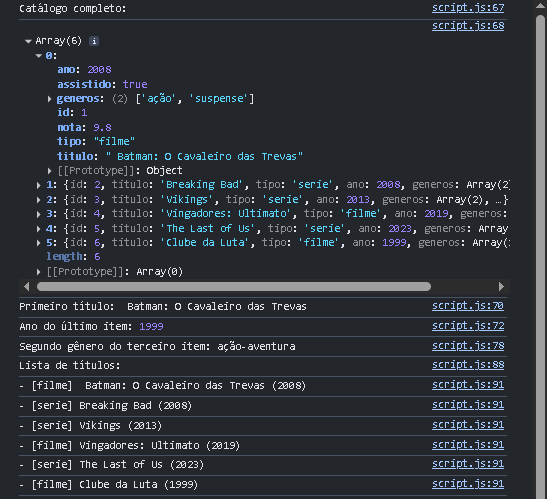
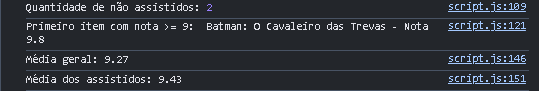
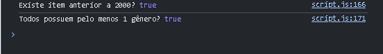
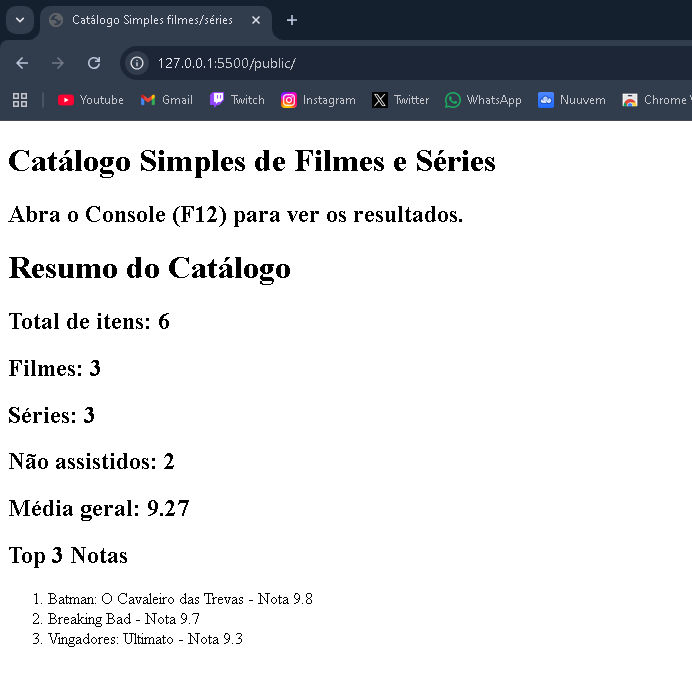

# Trabalho Prático - Semana 8

Nesta atividade, você irá fazer exercícios de programação com o objetivo de praticar a manipulação de objetos e arrays em JavaScript, passando pela definição de dados em notação **JSON (JavaScript Object Notation)**, acessando propriedades e itens, e usando iterators para processar os dados e gerar resultados.

## Informações Gerais

- Nome: Diogo Vieira Teodoro Ferreira
- Matrícula: 1645894

## Prints do console do navegador

<<- LISTAGEM DE TÍTULOS ->>

<<- CÁLCULO DE MÉDIAS ->>

<<- RESUMO DE VERIFICAÇÕES (SOME E EVERY) ->>

<< - PÁGINA COM O RESUMO ->>

